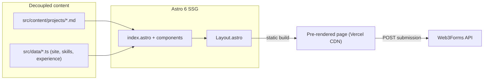

# Personal Portfolio — AI Engineering for Data, AI & Agribusiness

> A static, offline-first portfolio that frames every project as a business case study — problem → approach → measured result — so a technical recruiter gets the proof in the first scroll (e.g. "3rd of 1,300+ at FETEPS 2025", "~50% faster enterprise automation").

🌐 **Live demo:** [lukesz-portifolio.vercel.app](https://lukesz-portifolio.vercel.app/)

---

## What It Does

A single-page developer vitrine that turns a résumé into an evidence-driven landing page.

- **Case-study project cards** — each project is rendered from a Markdown file as *problem → approach → result*, with the headline metric highlighted.
- **Recruiter "smell test" hero** — role, availability, timezone and the three strongest measurable achievements above the fold.
- **Serverless contact form** — visitors send a message straight from the page, no backend to maintain.
- **Downloadable CV** — résumé served directly for one-click download.

## What It Is

This is a **static web app** that compiles to a fully pre-rendered landing page deployed on Vercel's CDN. It solves a concrete problem for one user — the author — by replacing a flat "list of repos" with a high-signal portfolio that proves capability to technical recruiters, academic peers, and industry stakeholders.

## Tech Stack

| Layer | Technology |
| --- | --- |
| Language | TypeScript 6, JavaScript |
| Framework / Runtime | Astro 6 (`output: 'static'`) |
| Styling | Tailwind CSS v4 (via PostCSS) |
| Content layer | Astro Content Collections + typed `src/data/*.ts` |
| Contact integration | Web3Forms (serverless form submission) |
| Hosting / CI | Vercel |

## Architecture



Content (projects, skills, experience, identity) is fully decoupled from rendering: components never hold copy. Astro builds everything to static HTML at compile time, and the only runtime call is the client-side `fetch` to Web3Forms when a visitor submits the contact form.

## Engineering Decisions

| Decision | Alternative considered | Why this approach |
| --- | --- | --- |
| Tailwind v4 wired through PostCSS (`postcss.config.mjs`) | Default `@tailwindcss/vite` plugin | Astro 6's Rolldown-based Vite throws `Missing field tsconfigPaths` with the Vite plugin; PostCSS sidesteps the path-resolution bug with no performance cost. |
| Content in Markdown collections + `src/data/*.ts` | Hard-coding copy inside `.astro` components | Updating a project, skill, or metric is a content edit — no HTML/CSS/TS changes — keeping components reusable and maintenance cheap. |
| Serverless contact form (Web3Forms) | A dedicated backend + database for submissions | Keeps the app 100% static for SEO and CDN delivery while still supporting outreach, with zero server to run. |
| Access key via `import.meta.env.PUBLIC_WEB3FORMS_KEY` with a safe fallback | Committing the key inline | Keeps active integration keys out of public Git history. |
| Presentation-only verification (build + type-check + Lighthouse + manual) instead of unit TDD | Minimal or full unit-test harness | A static vitrine has no business logic to unit-test; the four gates catch real regressions at lower cost. See [ADR-0001](docs/adr/0001-presentation-only-verification-policy.md). |
| Industrial-brutalist "Concrete Terminal" design language, shipped in phases | Heavier "Blueprint" industrial, quiet brutalist, big-bang redesign | A phased pilot delivers a distinctive recruiter-facing identity at low risk; other sections migrate later. See [ADR-0002](docs/adr/0002-industrial-brutalist-design-language.md). |
| GSAP (core) for the Hero intro, gated by `matchMedia` | CSS keyframes only; a React animation library | Precise reduced-motion-gated stagger in static Astro without introducing React. See [ADR-0003](docs/adr/0003-gsap-as-motion-library.md). |
| GSAP ScrollTrigger for scroll-driven section entrances | Keep CSS `[data-reveal]`; no scroll motion | Cohesive staggered, reduced-motion-gated reveals as the brutalist redesign moves below the fold, with no new dependency. See [ADR-0004](docs/adr/0004-scrolltrigger-for-section-motion.md). |
| Pinned horizontal Projects showcase over an accessible static base | Keep the 3D deck; static stack only | Maximum-impact case-study presentation on desktop, with a readable stack fallback for no-JS / reduced-motion / mobile. See [ADR-0005](docs/adr/0005-scrolltrigger-pin-projects-showcase.md). |
| Global CRT scan-beam ambient overlay (decorative, reduced-motion-gated) | Per-section behind-content beam; animated grid / aurora / particles; brightness flicker | One continuous, cheap (single `transform`) page-wide CRT sweep unifies the terminal ambience; non-blocking, low-opacity for legibility, removed under reduced motion. See [ADR-0006](docs/adr/0006-crt-ambient-overlay.md). |
| Client-side IP geolocation + build-time world map (unlabeled Contact-background easter egg) | SSR/edge geolocation; Browser Geolocation API; runtime map library (d3-geo/leaflet); a dedicated labeled section | Keeps the site fully static and runtime lean (no map library), no permission prompt, graceful fallback (author point renders on geo failure). Trade-off: visitor IP reaches a third-party geo API (coarse, not stored). See [ADR-0007](docs/adr/0007-client-side-geolocation-and-build-time-world-map.md). |
| Adaptive mobile experience: mobile-only sticky action bar + divergent feature treatments below `md` | One responsive layout stretched to all widths; a dedicated mobile information architecture | Recruiters mostly arrive on phones and decide in seconds, so mobile gets thumb-zone contact/CV, scannable static skills, a compacted hero, and a hidden decorative map — while desktop is untouched and there is no dual-IA to maintain. See [ADR-0008](docs/adr/0008-adaptive-mobile-experience.md). |

## Getting Started

### Prerequisites

- Node.js 18+
- A free [Web3Forms](https://web3forms.com) access key (only for the contact form)

### Installation

```bash
git clone https://github.com/LukeSantossz/portifolio.git
cd portifolio

npm install
cp .env.example .env   # then set PUBLIC_WEB3FORMS_KEY
```

### Running

```bash
npm run dev      # dev server at http://localhost:4321
npm run build    # optimized static bundle in /dist
npm run preview  # serve the production build locally
```

## Project Structure

```
portifolio/
├── src/
│   ├── components/
│   │   ├── sections/      # page sections (Hero, About, Services, Skills, …)
│   │   ├── ui/            # reusable widgets (Icon, SocialLinks, ProjectCard)
│   │   └── layout/        # site chrome (Nav, Footer)
│   ├── content/projects/  # one Markdown file per project (case-study schema)
│   ├── data/              # typed site config, skills, experience
│   ├── layouts/           # base Layout.astro
│   ├── pages/             # index.astro (single entry point)
│   └── styles/            # global.css (Tailwind v4 @theme)
├── public/                # static assets (résumé PDF, favicon, robots.txt)
├── docs/adr/              # architecture decision records
├── .standards/            # PONT STANDARDS governance (git submodule)
├── .githooks/             # local R2 cross-provider review pre-push hook
├── CLAUDE.md              # project memory → .standards governance
├── astro.config.mjs       # Astro + sitemap config
└── postcss.config.mjs     # Tailwind v4 via PostCSS
```

## Project Status

**Status: complete — live in production**

### Done

- [x] Static landing page with hero, about, services, experience, skills, projects and contact sections
- [x] Decoupled content architecture (Markdown collections + typed data)
- [x] Serverless contact form via Web3Forms
- [x] Downloadable CV and SEO metadata (sitemap, OG image, robots.txt)
- [x] Deployed to Vercel
- [x] Continuous integration workflow (type-check + build on push/PR)
- [x] Automated Lighthouse / accessibility budget
- [x] Post-deploy smoke test against the live Vercel URL

### Pending

- [ ] Real banner images for the project case studies (currently gradient monograms)
- [ ] Linter / formatter config (Prettier)

## Known Issues & Limitations

- **Single static page** — there is no router or multi-page navigation; everything lives on `index.astro`. Acceptable because the goal is a focused, single-scroll vitrine.
- **Contact key is public by design** — Web3Forms uses a public access key (`PUBLIC_*`), so it ships to the client. This is expected for the service; abuse is mitigated on Web3Forms' side, not in this repo.
- **No unit-test harness** — a presentational static site has little logic to unit-test, so correctness is verified by the build, type-check, the Lighthouse budget, and a manual checklist rather than unit tests. This is a documented, scoped deviation from test-first; see [ADR-0001](docs/adr/0001-presentation-only-verification-policy.md).

## Contact

Developed by **Lucas Gonçalves**.

- **Email:** [lucassg2015@gmail.com](mailto:lucassg2015@gmail.com)
- **LinkedIn:** [linkedin.com/in/lucas-gonçalvessz](https://www.linkedin.com/in/lucas-gon%C3%A7alvessz/)
- **GitHub:** [github.com/LukeSantossz](https://github.com/LukeSantossz)
