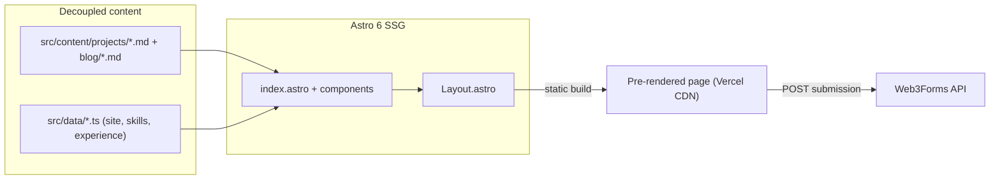

# Personal Portfolio, AI Engineer

> A static portfolio built as an editorial index: the work comes second, each project is a numbered row that opens into a full engineering record (problem, constraints, decision, what was rejected, measured result, how it was measured, known limits), and nothing but the decorative background field loads an external script.

🌐 **Live demo:** [lukesz-portifolio.vercel.app](https://lukesz-portifolio.vercel.app/)

---

## What It Does

A single-page developer vitrine that turns a resume into an evidence-driven landing page.

- **A numbered project index** — each row carries the headline metric and its domain so the index scans without opening anything; opening a row reveals the seven-part case-study record built from the project's Markdown frontmatter.
- **Recruiter "smell test" hero** — role, availability, timezone, resume, GitHub and LinkedIn above the fold at every width.
- **Serverless contact form** — visitors send a message straight from the page, no backend to maintain.
- **Downloadable CV** — the audited resume served directly for one-click download.

## What It Is

This is a **static web app** that compiles to a fully pre-rendered landing page deployed on Vercel's CDN. It solves a concrete problem for one user — the author — by replacing a flat "list of repos" with a high-signal portfolio that proves capability to technical recruiters, academic peers, and industry stakeholders.

## Tech Stack

| Layer | Technology |
| --- | --- |
| Language | TypeScript 6, JavaScript |
| Framework / Runtime | Astro 6 (`output: 'static'`) |
| Styling | Tailwind CSS v4 (via PostCSS), Archivo Variable + IBM Plex Mono |
| Content layer | Astro Content Collections + typed `src/data/*.ts` |
| Contact integration | Web3Forms (serverless form submission) |
| Hosting / CI | Vercel |

## Architecture



Content (projects, skills, experience, identity) is fully decoupled from rendering: components never hold copy. Astro builds everything to static HTML at compile time, and the only runtime call is the client-side `fetch` to Web3Forms when a visitor submits the contact form.

## Engineering Decisions

| Decision | Alternative considered | Why this approach |
| --- | --- | --- |
| Tailwind v4 wired through PostCSS (`postcss.config.mjs`) | Default `@tailwindcss/vite` plugin | Astro 6's Rolldown-based Vite throws `Missing field tsconfigPaths` with the Vite plugin; PostCSS sidesteps the path-resolution bug with no performance cost. |
| Content in Markdown collections + `src/data/*.ts` | Hard-coding copy inside `.astro` components | Updating a project, skill, or metric is a content edit — no HTML/CSS/TS changes — keeping components reusable and maintenance cheap. |
| Serverless contact form (Web3Forms) | A dedicated backend + database for submissions | Keeps the app 100% static for SEO and CDN delivery while still supporting outreach, with zero server to run. |
| Access key via `import.meta.env.PUBLIC_WEB3FORMS_KEY` with a safe fallback | Committing the key inline | Keeps active integration keys out of public Git history. |
| A copy gate (`scripts/check-copy.mjs`) run from `npm run check` | Trusting review; adding a spellchecker such as cspell | `AGENTS.md` already stated the copy rules and nothing checked them, so the site drifted into two Englishes, an accented label that disagreed with the file it served, and a link to a section id the restructure had renamed. A dependency-free script covers exactly the stated rules and fails CI on them. See [SPEC-0005](docs/specs/0005-english-copy-consistency-pass.md). |
| Presentation-only verification (build + type-check + Lighthouse + manual) instead of unit TDD | Minimal or full unit-test harness | A static vitrine has no business logic to unit-test; the four gates catch real regressions at lower cost. See [ADR-0001](docs/adr/0001-presentation-only-verification-policy.md). |
| Industrial-brutalist "Concrete Terminal" design language, shipped in phases | Heavier "Blueprint" industrial, quiet brutalist, big-bang redesign | A phased pilot delivers a distinctive recruiter-facing identity at low risk; other sections migrate later. See [ADR-0002](docs/adr/0002-industrial-brutalist-design-language.md). |
| Adaptive mobile experience: mobile-only sticky action bar + divergent feature treatments below `md` | One responsive layout stretched to all widths; a dedicated mobile information architecture | Recruiters mostly arrive on phones and decide in seconds, so mobile gets a thumb-zone action bar for email, resume and LinkedIn, while desktop keeps the hero CTAs and the Contact section. There is no second information architecture to maintain. Amended after the editorial restructure removed the Skills section and the Contact map it also described. See [ADR-0008](docs/adr/0008-adaptive-mobile-experience.md). |
| Defensive hardening: response headers + report-only CSP, env-gated form hCaptcha, SHA-pinned Actions, security.txt | Enforcing CSP immediately; no captcha; major dependency bumps now | Closes real hardening gaps with zero behavior change and zero breakage risk; CSP observes before enforcing, and the captcha is off until configured. See [ADR-0010](docs/adr/0010-security-hardening.md). |
| Landing page as five asymmetric blocks (Hero, Work, Experience, About, Contact), with projects as a numbered index of expanding records | Seven symmetric numbered sections with a project card grid; a sortable project table | The evidence moves to second position, and the record keeps the density a table cell cannot hold. Seven of nine well-regarded engineer portfolios use no card grid; the one that does is the most-cloned template on the web. See [ADR-0014](docs/adr/0014-editorial-index-restructure.md). |
| One CSS + IntersectionObserver reveal for page motion, no animation library | GSAP core with ScrollTrigger (previous approach); GSAP core for the project index only | The disclosure is native `<details>`, which left the library one two-column fade to justify 70 KB. Shipped JS fell from 119,460 bytes across two chunks to ~8 KB inline with no external script file, and the hidden state is one class no inline style can outlive. Supersedes ADR-0003 and ADR-0004. See [ADR-0014](docs/adr/0014-editorial-index-restructure.md). |
| Blue as the single accent, plus a reactive WebGL background field on the hero | Green accent (previous); blue as a second accent beside green; no 3D at all | The cool signal reads as instrumentation rather than agriculture, and one chromatic signal is easier to keep coherent than two. The field is decoration and is recorded as such: three.js loads after `load` inside `requestIdleCallback`, so no external script blocks first paint (measured: LCP 1.7s to 1.8s, TBT 0ms to 60ms, CLS unchanged). See [ADR-0015](docs/adr/0015-blue-accent-and-ambient-field.md). |
| Personal blog as a dedicated `/blog/` area (Markdown collection + build-time per-post pages), linked from the nav after Resume | A section embedded in the landing page; an external host (Medium/Dev.to); SSR post pages | A separate `/blog/` index + `/blog/<slug>/` pages generated statically from `src/content/blog/*.md` — kept off the one-page pitch, content-decoupled, SEO-owned, no new dependency, no SSR; drafts are excluded from the build. See [ADR-0011](docs/adr/0011-blog-content-collection-and-static-post-pages.md). |
| Automatic light/dark theme via `prefers-color-scheme` (same palette, no toggle) | Dark-only; a manual theme toggle with persistence; a duplicate light stylesheet | Flip the Tailwind `@theme` custom properties under a `prefers-color-scheme: light` media query so every utility re-themes with no per-component edits; follows the visitor's system setting. See [ADR-0012](docs/adr/0012-automatic-light-dark-theme.md). |

## Getting Started

### Prerequisites

- Node.js 22.12+ (the installed Astro declares it in `engines`; CI runs 22, Vercel runs 24)
- A free [Web3Forms](https://web3forms.com) access key (only for the contact form)

### Installation

```bash
git clone https://github.com/LukeSantossz/portifolio.git
cd portifolio

npm install
cp .env.example .env   # then set PUBLIC_WEB3FORMS_KEY
```

### Running

```bash
npm run dev      # dev server at http://localhost:4321
npm run build    # optimized static bundle in /dist
npm run preview  # serve the production build locally
```

## Project Structure

```
portifolio/
├── src/
│   ├── components/
│   │   ├── sections/      # the four blocks below the hero (Work, Experience, About, Contact)
│   │   ├── ui/            # reusable widgets (Icon, SocialLinks, ProjectRecord, PostCard)
│   │   └── layout/        # site chrome (Nav, Footer, Section, MobileActionBar, AmbientField)
│   ├── content/projects/  # one Markdown file per project (case-study schema)
│   ├── content/blog/      # one Markdown file per blog post (title/date/tags/body)
│   ├── data/              # typed site config, section copy, skills, experience
│   ├── layouts/           # base Layout.astro
│   ├── pages/             # index.astro + blog/ (index + [...slug] post pages) + 404
│   ├── scripts/           # reveal.ts (the one IntersectionObserver reveal)
│   └── styles/            # global.css (Tailwind v4 @theme)
├── public/                # static assets (resume PDF, favicon, robots.txt)
├── scripts/               # generate-og.mjs, check-copy.mjs (the copy gate)
├── docs/adr/              # architecture decision records
├── docs/specs/            # the spec behind each significant change
├── CLAUDE.md              # project memory and development conventions
├── astro.config.mjs       # Astro + sitemap config
└── postcss.config.mjs     # Tailwind v4 via PostCSS
```

## Project Status

**Status: complete — live in production**

### Done

- [x] Static landing page as five blocks: hero, work, experience, about, contact
- [x] Project index of expanding case-study records, plus a `/blog/` area and a 404 page
- [x] Decoupled content architecture (Markdown collections + typed data)
- [x] Serverless contact form via Web3Forms
- [x] Downloadable resume and SEO metadata (sitemap, OG image, robots.txt)
- [x] Deployed to Vercel
- [x] Continuous integration workflow (copy gate + type-check + build on push/PR)
- [x] Automated Lighthouse / accessibility budget
- [x] Post-deploy smoke test against the live Vercel URL
- [x] Copy gate enforcing the rules `AGENTS.md` states

### Pending

- [ ] A deployed demo for VisioSoil and for the sentiment project. The forecasting
      dashboard is live and linked from its record; SmartB100 is self-hosted through a
      Docker image, which is not a link a reader can click
- [ ] Three experience bullets that carry no measured result (both CIAg bullets, and the
      Jacto computer-vision system, which is still in internal review)
- [ ] Linter / formatter config (Prettier)
- [ ] Two dependencies stuck behind a major bump: see Security below

## Known Issues & Limitations

- **One landing page plus a small routed area** — the pitch lives on `index.astro`; `/blog/`, each post and the 404 page are separate statically built routes. Subpages use their own header because the landing nav is built on `#section` anchors that only resolve on `/`.
- **Contact key is public by design** — Web3Forms uses a public access key (`PUBLIC_*`), so it ships to the client. This is expected for the service; abuse is mitigated on Web3Forms' side, not in this repo.
- **No unit-test harness** — a presentational static site has little logic to unit-test, so correctness is verified by the build, type-check, the Lighthouse budget, and a manual checklist rather than unit tests. This is a documented, scoped deviation from test-first; see [ADR-0001](docs/adr/0001-presentation-only-verification-policy.md).

## Security

- **Response headers** (via `vercel.json`): `X-Frame-Options: DENY`, `X-Content-Type-Options: nosniff`, `Referrer-Policy`, `Permissions-Policy`, and a Content-Security-Policy in **Report-Only** mode (observe-before-enforce).
- **Contact form**: a honeypot plus an optional hCaptcha widget rendered via the own-sitekey integration. Set `PUBLIC_HCAPTCHA_SITEKEY` to your hCaptcha sitekey and also add the matching hCaptcha secret to your Web3Forms dashboard so Web3Forms validates the token. The report-only CSP allows the hCaptcha origins. The public Web3Forms key should also be domain-restricted in the Web3Forms dashboard.
- **Supply chain**: GitHub Actions pinned to commit SHAs; dependencies tracked via Dependabot.
- **Dependency status, 15 September 2026**: `npm audit` reported 13 advisories. Every
  non-breaking fix is applied and 3 remain, all of them held back by a major bump:
  - `astro` (critical): fixed in 7.x. The five advisories are XSS through the renderer,
    reflected XSS through View Transition properties, an authorization bypass when
    stripping a configured base, and remote code execution through AVIF image
    optimization. This site builds with `output: 'static'` and has no SSR, no middleware,
    no configured `base` and no image optimization, and the only input reaching the
    renderer is content committed to this repository, so none of the five has a reachable
    path in the deployed output. The upgrade is still the right end state; it is a major
    and is not being done in the same change as a copy pass.
  - `sharp` (high): inherited libvips and libheif issues, fixed in 0.35. Used only by
    `scripts/generate-og.mjs`, which runs at build time over one image this repository
    controls.
  - One low-severity advisory in `esbuild` affects its development server on Windows,
    which is reachable when running `npm run dev` locally, not in production.

  GitHub reports a higher count than `npm audit` because it counts one alert per advisory
  per manifest, including the lockfile.
- **Disclosure**: see [`/.well-known/security.txt`](public/.well-known/security.txt).

See [ADR-0010](docs/adr/0010-security-hardening.md) for the rationale.

## Contact

Developed by **Lucas Gonçalves**.

- **Email:** [lucassg2015@gmail.com](mailto:lucassg2015@gmail.com)
- **LinkedIn:** [linkedin.com/in/lucas-gonçalvessz](https://www.linkedin.com/in/lucas-gon%C3%A7alvessz/)
- **GitHub:** [github.com/LukeSantossz](https://github.com/LukeSantossz)
